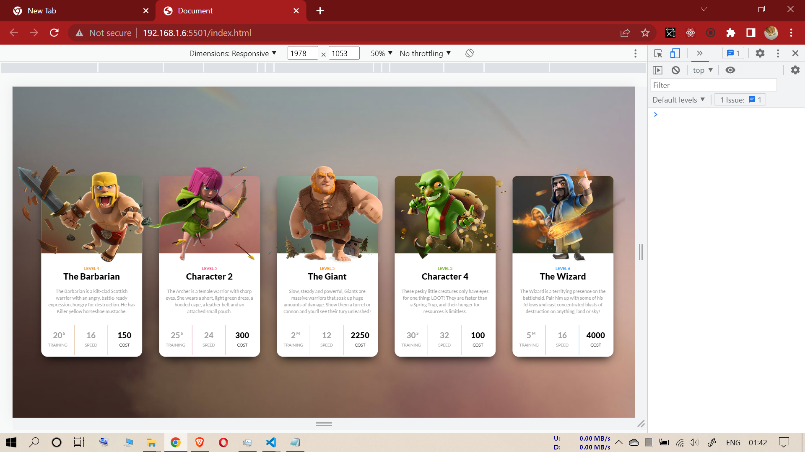
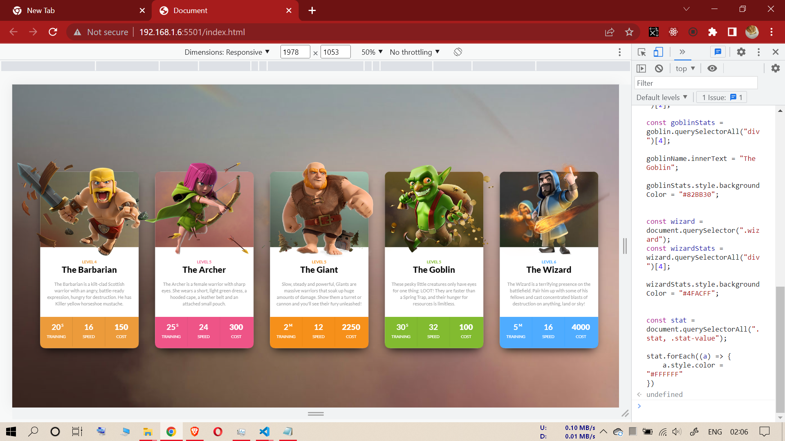

# FOURTH ASSIGNMENT

## INPUT IMAGE

--------------------------------------------------

## TASK (Fourth Assignment)

### **KINDLY, PLEASE PASTE ALL THE CODES (ONLY CODES) AT ONCE INSIDE CHROME CONSOLE WITHOUT ANY HEADLINES AND BOLD STATEMENTS**

--------------------------------------------------

**1-(barbarian stat section background color should be "#EC9B3B")**

**2-(archer character name should be "The Archer"; and stat section background color should be "#EE5487")**

**3-(giant stat section background color should be "#F6901A")**

**4-(goblin character name should be "The Goblin"; and stat section background color should be "#82BB30")**

**5-(barbarian stat section background color should be "#4FACFF")**

**6-(All the stats and stat-value div texts font color inside all clash cards should be "#FFFFFF")**

----------------------------------------------------------
### **Code**

const barbarianStats = document.querySelector(".clash-card__unit-stats"); 

barbarianStats.style.backgroundColor = "#EC9B3B";

const archer = document.querySelector(".archer");

const archerName = archer.querySelectorAll("div")[2];

const archerStats = archer.querySelectorAll("div")[4];

archerName.innerText = "The Archer";

archerStats.style.backgroundColor = "#EE5487"; 

const giant = document.querySelector(".giant");

const giantStats = giant.querySelectorAll("div")[4];

giantStats.style.backgroundColor = "#F6901A";

const goblin = document.querySelector(".goblin");

const goblinName = goblin.querySelectorAll("div")[2];

const goblinStats = goblin.querySelectorAll("div")[4];

goblinName.innerText = "The Goblin";

goblinStats.style.backgroundColor = "#82BB30";

const wizard = document.querySelector(".wizard");
const wizardStats = wizard.querySelectorAll("div")[4];

wizardStats.style.backgroundColor = "#4FACFF";

const stat = document.querySelectorAll(".stat, .stat-value");

stat.forEach((a) => {
    a.style.color = "#FFFFFF"
})

------------------------------------
**task output (Fourth Assignment)**

------------------------------------
------------------------------------
------------------------------------