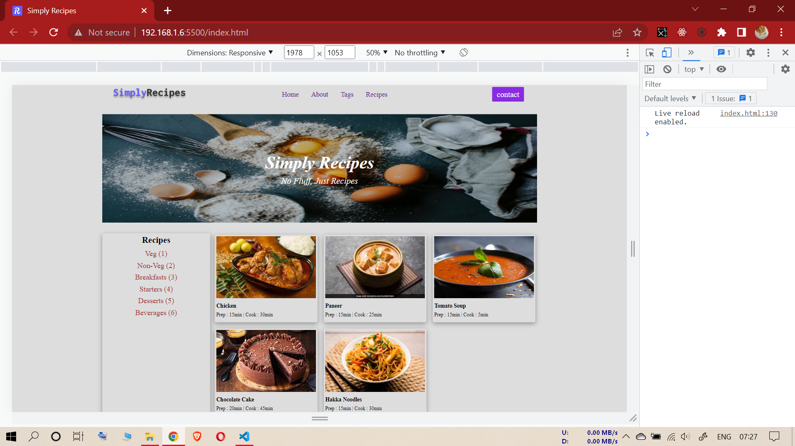
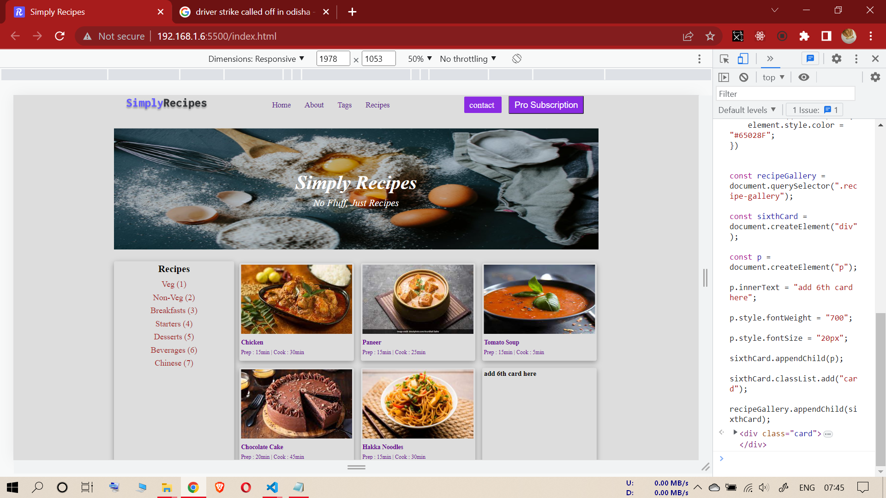

# FIFTH ASSIGNMENT

## INPUT IMAGE

--------------------------------------------------------

## TASK (Fifth Assignment)

### **KINDLY, PLEASE PASTE ALL THE CODES (ONLY CODES) AT ONCE INSIDE CHROME CONSOLE WITHOUT ANY HEADLINES AND BOLD STATEMENTS**

--------------------------------------------------

**1-(Adding a new button next to contact button with text "Pro Subscription")**

**2-(Adding 7th anchor tag "Chinese (7)" to receipes list)**

**3-(Changing recipe-gallery card font color)**

**4-(Adding 6th card inside receipe gallery with text "add 6th card here")**

----------------------------------------------------------

### **Code**

const navCenter = document.querySelector(".nav-center");

const buttonDiv = navCenter.querySelectorAll("div")[2];

const proBtn = document.createElement("button");

proBtn.innerText = "Pro Subscription";

proBtn.classList.add("btn");

buttonDiv.appendChild(proBtn);

const tagsContainer = document.querySelector(".tags-container");

const tagDiv = tagsContainer.querySelector("div");

const a = document.createElement("a");

a.innerText = "Chinese (7)";

tagDiv.appendChild(a);

const text = document.querySelectorAll(".recipe-text h5, p");

text.forEach((element) => {
    element.style.color = "#65028F";
})

const recipeGallery = document.querySelector(".recipe-gallery");

const sixthCard = document.createElement("div");

const p = document.createElement("p");

p.innerText = "add 6th card here";

p.style.fontWeight = "700";

p.style.fontSize = "20px";

sixthCard.appendChild(p);

sixthCard.classList.add("card");

recipeGallery.appendChild(sixthCard);

------------------------------------
**task output (Fifth Assignment)**

------------------------------------
------------------------------------
------------------------------------