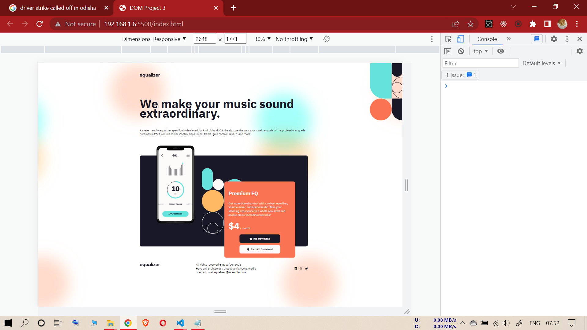
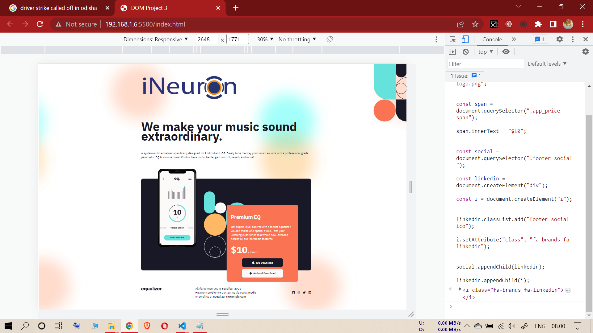

# FOURTH ASSIGNMENT

## INPUT IMAGE

--------------------------------------------------

## TASK (Sixth Assignment)

### **KINDLY, PLEASE PASTE ALL THE CODES (ONLY CODES) AT ONCE**

--------------------------------------------------

**1-(Changing logo image to ineuron logo image)**

**2-(Changing app_price from $4/month to $10/month)**

**3-("Adding linkedin icon at the footer social section")**

----------------------------------------------------------

### **Code**

const logoImg = document.querySelector(".logo");

logoImg.src = "./assets/ineuron-logo.png";

const span = document.querySelector(".app_price span");

span.innerText = "$10";

const social = document.querySelector(".footer_social");

const linkedin = document.createElement("div");

const i = document.createElement("i");

linkedin.classList.add("footer_social_ico");

i.setAttribute("class", "fa-brands fa-linkedin");

social.appendChild(linkedin);

linkedin.appendChild(i);

------------------------------------
**task output (Sixth Assignment)**

------------------------------------
------------------------------------
------------------------------------