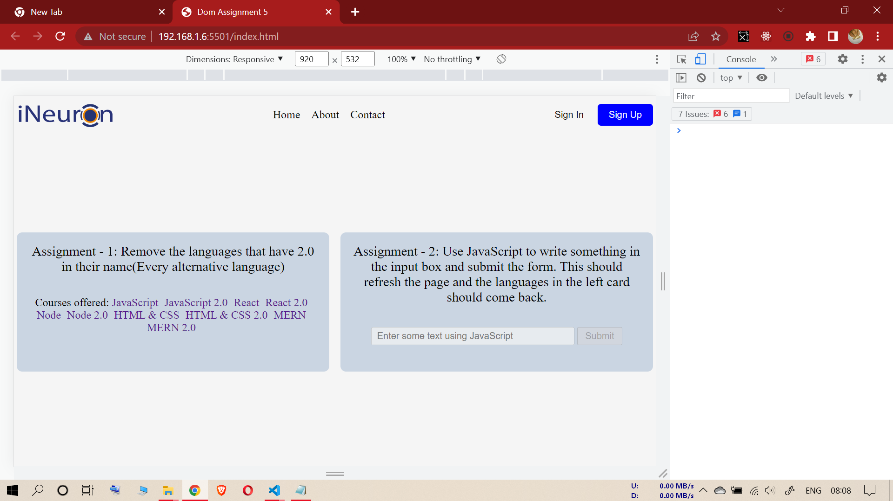
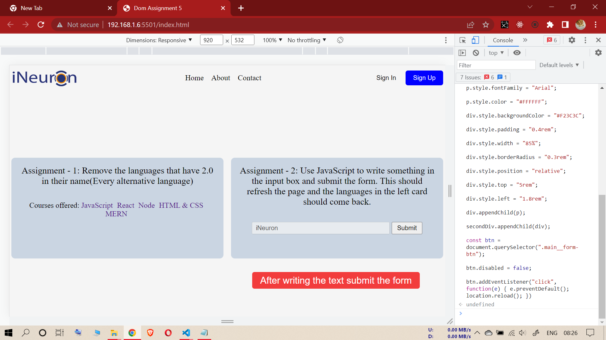

# SEVENTH ASSIGNMENT

## INPUT IMAGE

--------------------------------------------------

## TASK (Seventh Assignment)

### **KINDLY, PLEASE PASTE ALL THE CODES (ONLY CODES) AT ONCE**

--------------------------------------------------

### **Code**

**1- (Removing alternative languages from "main__languages" div)**

**2- (Giving input value inside the submit form)**

**3- (Creating instruction div below "main__form" div)**

**4- (Enabling submit button)**

**5- (Refreshing the page to initial state after clicking submit button) (This will bring back all the removed languages)**

----------------------------------------------------------

### **Code**

const mainLanguages = document.querySelectorAll(".main__languages a");

const removeNodes = () => {
    for (let i = 0; i <= 9; i++) {
        if(i % 2 != 0) {
            mainLanguages[i].remove();
        }
    }
}

removeNodes();

const form = document.querySelector(".main__form-input");

form.value = "iNeuron";

const secondDiv = document.querySelector(".main__form");

const div = document.createElement("div");

const p = document.createElement("p");

p.innerText = "After writing the text submit the form";

p.style.fontSize = "20px";

p.style.fontFamily = "Arial";

p.style.color = "#FFFFFF";

div.style.backgroundColor = "#F23C3C";

div.style.padding = "0.4rem";

div.style.width = "85%";

div.style.borderRadius = "0.3rem";

div.style.position = "relative";

div.style.top = "5rem";

div.style.left = "1.8rem";

div.appendChild(p);

secondDiv.appendChild(div);

const btn = document.querySelector(".main__form-btn");

btn.disabled = false;

btn.addEventListener("click", function(e) {
    e.preventDefault();
    location.reload();
})

-----------------------------------------------------------------
**PLEASE CLICK SUBMIT BUTTON AFTER PASTING THE CODE TO RELOAD THE PAGE**

-----------------------------------------------------------------

------------------------------------
**task output (Seventh Assignment)**

------------------------------------
------------------------------------
------------------------------------

