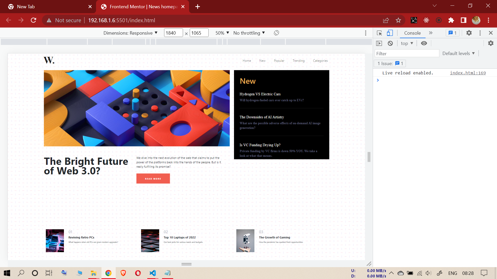
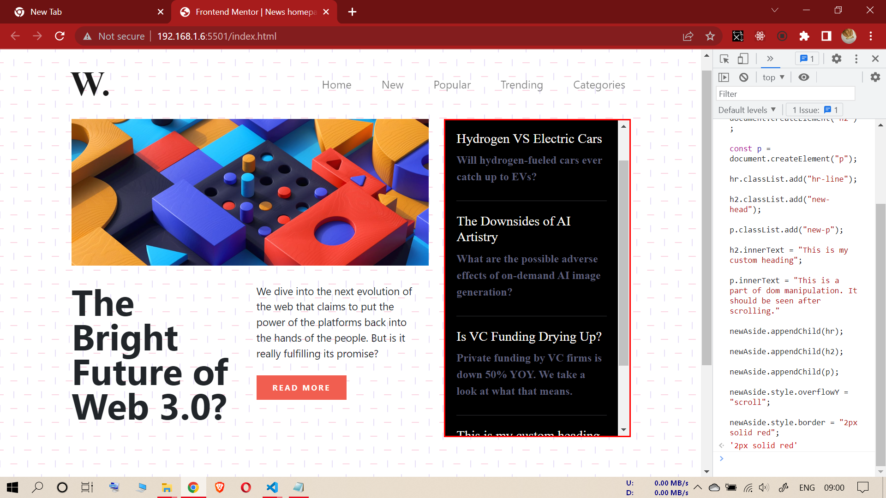
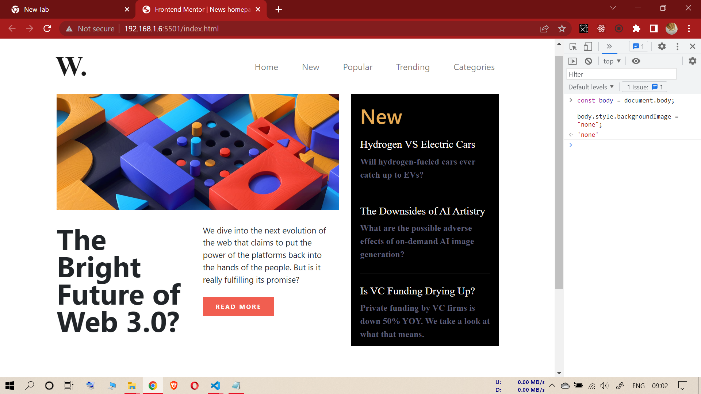
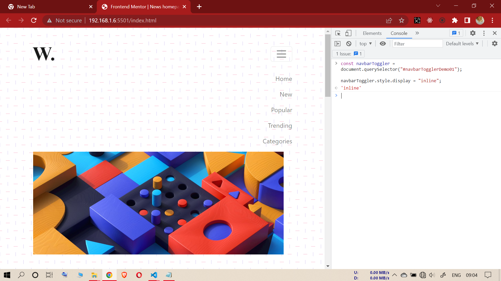

# EIGHTH ASSIGNMENT

## INPUT IMAGE

--------------------------------------------------

## TASK (Sixth Assignment)

### **FOR EACH TASK PLEASE PASTE THE CODE FOR THAT TASK ONLY**

----------------------------------------------------------

**1-(To add new hr, h2, and p inside aside. To add content in h2 and p. Making aside section scrollable with red borders)**

### **Code**

const newAside = document.querySelector(".new");

const hr = document.createElement("hr");

const h2 = document.createElement("h2");

const p = document.createElement("p");

hr.classList.add("hr-line");

h2.classList.add("new-head");

p.classList.add("new-p");

h2.innerText = "This is my custom heading";

p.innerText = "This is a part of dom manipulation. It should be seen after scrolling.";

newAside.appendChild(hr);

newAside.appendChild(h2);

newAside.appendChild(p);

newAside.style.overflowY = "scroll";

newAside.style.border = "2px solid red";

------------------------------------
**task-1 output (Eighth Assignment)**

------------------------------------
------------------------------------
------------------------------------

**2-(To make the background image of the body disapear)**

### **Code**

const body = document.body;

body.style.backgroundImage = "none";

------------------------------------
**task-2 output (Eighth Assignment)**

------------------------------------
------------------------------------
------------------------------------

**3-(In the smartphone view mode open the menu present inside navbar toggle button)**

const navbarToggler = document.querySelector("#navbarTogglerDemo01");

navbarToggler.style.display = "inline";

------------------------------------
**task-3 output (Eighth Assignment)**

------------------------------------
------------------------------------
------------------------------------