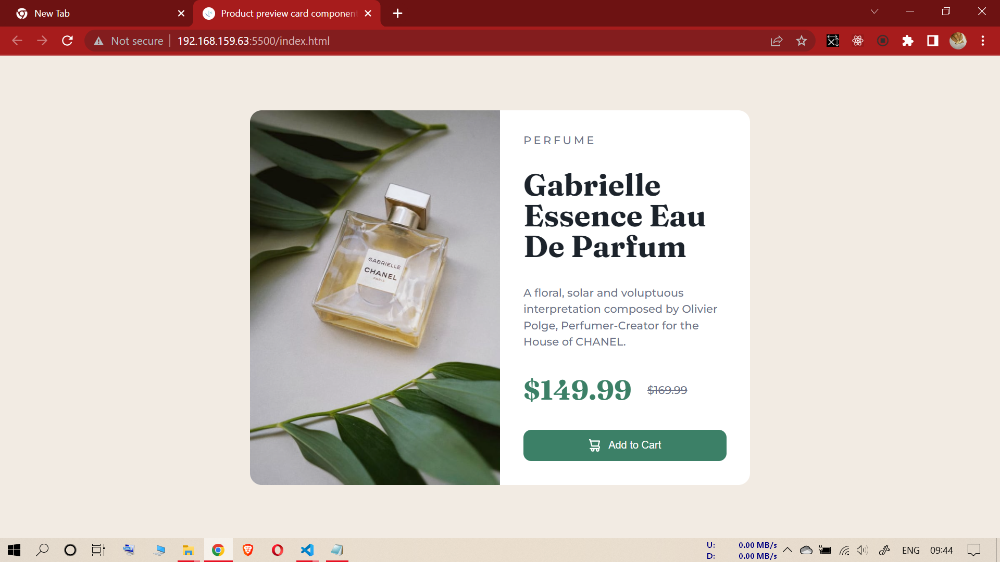
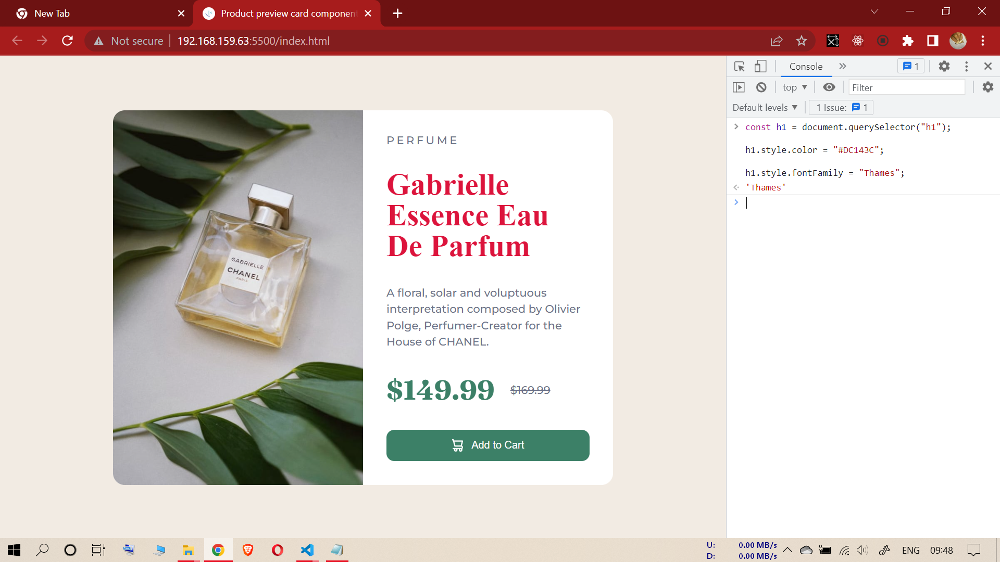

# NINTH ASSIGNMENT

## INPUT IMAGE

--------------------------------------------------

## TASK (Sixth Assignment)

### **FOR EACH TASK PLEASE PASTE THE CODE FOR THAT TASK ONLY**

----------------------------------------------------------

**1- (Changing heading font color and font-family)**

### **Code**

const h1 = document.querySelector("h1");

h1.style.color = "#DC143C";

h1.style.fontFamily = "Thames";

------------------------------------
**task-1 output (Ninth Assignment)**

------------------------------------
------------------------------------
------------------------------------

**2- (Changing the button backgroundColor to "#DC143C" upon hovering)** 

const cartBtn = document.querySelector(".add-to-cart");

cartBtn.addEventListener("mouseenter", function() {
    cartBtn.style.backgroundColor = "#DC143C";
})

cartBtn.addEventListener("mouseleave", function() {
    cartBtn.style.backgroundColor = "";
})

------------------------------------
**Its a picture taken from camera as cursor-pointer hand was not shown in screenshot**

**task-2 output (Ninth Assignment)**

------------------------------------
------------------------------------
------------------------------------